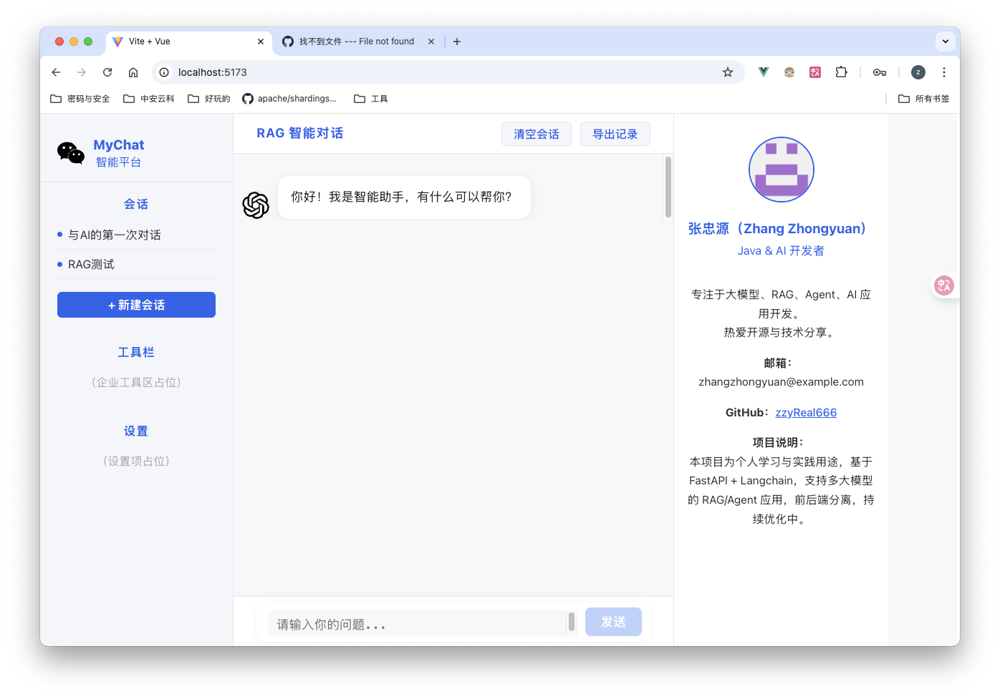

# MyChat

> 基于 FastAPI + Langchain 的大模型 RAG/Agent 学习与实践项目

---

## 项目简介

MyChat 是一个面向大模型、RAG（检索增强生成）、Agent 应用开发的学习型开源项目。采用前后端分离架构，支持多种主流大模型，便于个人和团队快速实践与二次开发。

---

## 特性

- ✨ 支持多种大模型（ChatGLM、Qwen、Llama 等）
- 🔍 集成 RAG 检索增强生成能力
- 🧑‍💻 Agent 智能体开发基础
- 🗂️ 多知识库适配（FAISS、Milvus 等）
- 🖥️ 前后端分离（FastAPI + Vue3 + Vite）
- 🛠️ 丰富的开发脚本与自动化工具
- 🧪 完善的测试与类型检查
- 📦 Docker/K8s 支持，易于部署
- 📚 持续优化与文档完善

---

## 界面预览



> 主界面：左侧为会话与工具栏，右侧为作者信息区，中间为智能对话窗口。

---

## 目录结构（详细说明，适合新手）

```text
MyChat/
├── backend/                  # 后端服务（Python FastAPI）
│   └── app/
│       ├── api/              # 路由与接口（如 chat.py、user.py，定义API入口）
│       ├── core/             # 核心配置与启动（如 main.py 启动入口、config.py 配置）
│       ├── db/               # 数据库相关（如 init_db.py 初始化脚本）
│       ├── llms/             # 大模型适配（如 chatglm.py、llama.py、qwen.py，统一接口base.py）
│       ├── models/           # 数据模型（如 user.py，定义ORM/Pydantic模型）
│       ├── services/         # 业务逻辑层（如 rag_service.py、user_service.py，处理具体业务）
│       ├── tasks/            # 异步任务/定时任务（预留，便于扩展）
│       ├── utils/            # 工具函数（预留，便于扩展）
│       └── README.md         # 各子模块说明文档
│   ├── tests/                # 后端测试用例
│   └── requirements.txt      # 后端依赖
│
├── frontend/                 # 前端项目（Vue3 + Vite）
│   ├── src/
│   │   ├── api/              # 前端API请求封装
│   │   ├── components/       # 前端UI组件（如 ChatWindow、ChatInput、ChatMessage、ReferenceList）
│   │   ├── assets/           # 静态资源
│   │   ├── App.vue           # 应用主入口
│   │   └── main.js           # 前端入口文件
│   ├── public/               # 公共静态资源
│   ├── package.json          # 前端依赖
│   └── README.md             # 前端说明文档
│
├── deploy/                   # 部署相关（K8s、Docker等）
│   ├── k8s/                  # Kubernetes 部署文件
│   └── scripts/              # 部署辅助脚本
│
├── scripts/                  # 各类开发、部署、数据处理脚本，便于自动化运维
│
├── doc/                      # 项目文档、学习笔记、FAQ等
│
├── .github/                  # GitHub Actions、Issue模板、CI/CD配置
│
└── README.md                 # 项目说明（入口文档）
```


## 快速开始

### 1. 克隆项目

```bash
git clone https://github.com/zzyReal666/MyChat.git
cd MyChat
```

### 2. 安装依赖

```bash
# 后端
cd backend
pip install -r requirements.txt

# 前端
cd ../frontend
npm install
```

### 3. 启动服务

```bash
# 后端
cd backend
uvicorn app.core.main:app --reload

# 前端
cd ../frontend
npm run dev
```

### 4. 访问

- 前端：http://localhost:5173
- 后端API：http://localhost:8000/docs

---

## 常见问题

- Node.js 推荐 20+ 版本，建议使用 nvm 管理
- 数据库默认使用 Postgres，需先启动数据库服务
- 更多问题请见 [FAQ](doc/FAQ.md) 或提交 Issue

---

## 贡献指南

欢迎任何形式的贡献！请阅读 [CONTRIBUTING.md](doc/CONTRIBUTING.md) 了解详细流程。

- Fork 本仓库并新建分支
- 提交 PR 前请确保通过所有测试和 lint 检查
- PR 模板见 `.github/pull_request_template.md`

---

## 社区与交流

- 作者：张忠源（Zhang Zhongyuan）
- 邮箱：zhangzhongyuan@example.com
- GitHub: [zzyReal666](https://github.com/zzyReal666)
- 欢迎提 Issue、PR 或加入讨论！

---

## License

[MIT License](LICENSE)

---

## CI/CD 简要说明

本项目已集成企业级 CI/CD 流水线，自动完成测试、构建、部署等流程。详细配置与说明请见 [`.github/workflows/README.md`](.github/workflows/README.md)。
